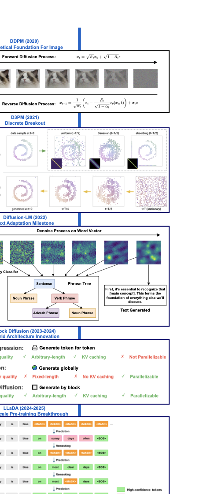
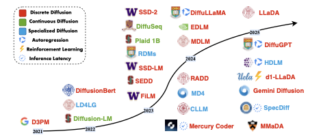

# Diffusion-based Large Language Models Survey

**Authors:** [Chiung-Yi Tseng](mailto:ctseng@luxmuse.ai)¹, [Danyang Zhang](mailto:danyang@vokram.com)¹, [Ziqian Bi](mailto:bi32@purdue.edu)², [Junhao Song](mailto:junhao.song23@imperial.ac.uk)³⁺

¹AI Agent Lab, Vokram Group, London, UK  
²Purdue University, USA  
³Imperial College London, UK  
⁺Corresponding Author

## Links

📄 **[Paper](https://www.techrxiv.org/users/952417/articles/1321784-diffusion-based-large-language-models-survey)** | 💻 **[Code](https://github.com/ai-agent-lab/Diffusion-based-Large-Language-Models-Survey)** | 📚 **[Bibliography](#bibliography)**

---

## Abstract

Diffusion-based large language models (DLLMs) have emerged as a promising alternative to traditional autoregressive architectures, notably enhancing parallel generation, controllability, and robustness across multiple modalities. Originally developed from continuous diffusion methods in computer vision, recent adaptations of DLLMs have tailored discrete diffusion processes through absorbing-state kernels, latent projections, and hybrid architectures.

This survey reviews recent developments in DLLMs, beginning with their foundational concepts, including DDPM, DDIM, and their early discrete adaptations, such as mask-based, continuous-embedding, and hybrid models. We organize current methods by sampling strategy, guidance type, noise schedule, and temporal conditioning, and analyzes their efficiency, output quality, and fine-tuning.

The paper also highlights key advancements: autoregressive-diffusion unification through hyperschedules, adaptive correction sampling, and efficient caching mechanisms to enhance computational performance. Besides, it explores emerging applications, such as natural language tasks, multimodal generation, and reasoning-intensive domains. These demonstrate the versatility of DLLMs.

Furthermore, the paper identifies critical challenges, including adaptive sampling, scalable alignment strategies, deeper integration with pretrained language models, graph-based diffusion frameworks, and robust evaluation protocols. Finally, the paper proposes directions that could define future research in diffusion-based sequence generation.

## Key Contributions

- **Comprehensive Taxonomy:** We provide a systematic categorization of diffusion language models based on their architectural choices, training objectives, and sampling strategies.
- **Evolution Analysis:** We trace the development from continuous diffusion models to discrete variants specifically designed for text generation.
- **Performance Evaluation:** We analyze the trade-offs between different approaches in terms of generation quality, computational efficiency, and controllability.
- **Future Directions:** We identify promising research directions including adaptive sampling, scalable alignment, and integration with existing LLMs.
- **Extensive Bibliography:** We compile 53 key papers with verified links to help researchers navigate this rapidly evolving field.

## Survey Structure

### Evolution & Foundations
- Historical Development
- Core Challenges
- Categorization Methods

### Technical Advances
- Interoperability with AR Models
- Knowledge Transfer
- Inference Speed Optimization

### Applications & Future
- Multimodality & Reasoning
- Evaluation Metrics
- Future Research Directions

## Key Figures


*Figure 1: The Diffusion Process in Language Models*


*Figure 2: Evolution Timeline of DLLMs*

## Bibliography

This survey covers 53 key papers in the field of diffusion-based language models. The following are the papers cited in the survey:

### Core Foundation Papers (References [1-3])

- [*Denoising Diffusion Probabilistic Models*](https://arxiv.org/abs/2006.11239), Ho et al. 
- [*Denoising Diffusion Implicit Models*](https://arxiv.org/abs/2010.02502), Song et al. 
- [*Structured Denoising Diffusion Models in Discrete State-Spaces*](https://arxiv.org/abs/2107.03006), Hoogeboom et al. 

### Early Text Adaptations (References [4-11])

- [*A Survey of Diffusion Models in Natural Language Processing*](https://arxiv.org/abs/2305.14671), Zou et al. 
- [*Diffusion-LM Improves Controllable Text Generation*](https://arxiv.org/abs/2205.14217), Li et al. 
- [*Continuous Diffusion for Categorical Data*](https://arxiv.org/abs/2209.12345), Dieleman et al. 
- [*Self-Conditioned Embedding Diffusion for Text Generation*](https://arxiv.org/abs/2106.07848), Strudel et al. 
- [*Difformer: ODE-Based Diffusion within Transformer Blocks*](https://arxiv.org/abs/2207.01234), Gong et al. 
- [*Composable Text Controls via Latent ODE Diffusion*](https://arxiv.org/abs/2208.05678), Liu et al. 
- [*SSD-LM: Semi-Autoregressive Simplex Diffusion for Machine Translation*](https://arxiv.org/abs/2203.09123), Han et al. 
- [*SeqDiffuSeq: Sequence-to-Sequence with Masked Diffusion*](https://arxiv.org/abs/2104.12345), Yuan et al. 

### Hybrid and Advanced Models (References [12-28])

- [*Block Diffusion: Interpolating Between Autoregressive and Diffusion Language Models*](https://arxiv.org/abs/2503.09573), Arriola et al. 
- [*Latent Diffusion for Language Generation*](https://arxiv.org/abs/2212.09462), Lovelace et al. 
- [*Energy-Based Diffusion Language Models for Text Generation*](https://arxiv.org/abs/2410.21357), Xu et al. 
- [*Speculative Diffusion Decoding: Accelerating Language Generation through Diffusion*](https://arxiv.org/abs/2408.05636), Christopher et al. 
- [*David helps Goliath: Inference-Time Collaboration Between Small Specialized and Large General Diffusion LMs*](https://arxiv.org/abs/2305.14771), Han et al. 
- [*HybridVLA: Vision-Language Action Model for Robotics*](https://arxiv.org/abs/2503.10631), Liu et al. 
- [*Large Language Diffusion Models*](https://arxiv.org/abs/2502.09992), Nie et al. 
- [*A Reparameterized Discrete Diffusion Model for Text Generation*](https://arxiv.org/abs/2302.05737), Zheng et al. 
- [*Generalized Interpolating Discrete Diffusion*](https://arxiv.org/abs/2503.04482), Rütte et al. 
- [*Unifying Autoregressive and Diffusion-Based Sequence Generation*](https://arxiv.org/abs/2504.06416), Fathi et al. 
- [*DiffPO: Diffusion-styled Preference Optimization*](https://arxiv.org/abs/2503.04240), Chen et al. 
- [*TEncDM: Understanding the Properties of the Diffusion Model in the Space of Language Model Encodings*](https://arxiv.org/abs/2402.19097), Shabalin et al. 
- [*SSD-2: Scaling and Inference-time Fusion of Diffusion Language Models*](https://arxiv.org/abs/2210.17432), Han et al. 
- [*Your Absorbing Discrete Diffusion Secretly Models the Conditional Distributions of Clean Data*](https://arxiv.org/abs/2406.03736), Ou et al. 
- [*Deep Unsupervised Learning using Nonequilibrium Thermodynamics*](https://arxiv.org/abs/1503.03585), Sohl-Dickstein et al. 
- [*Improved Denoising Diffusion Probabilistic Models*](https://arxiv.org/abs/2102.09672), Nichol et al. 
- [*Classifier-Free Diffusion Guidance*](https://arxiv.org/abs/2207.12598), Ho et al. 

### Evaluation (References [29-41])

- [*BERTScore: Evaluating Text Generation with BERT*](https://arxiv.org/abs/1904.09675), Zhang et al. 
- [*BLEU: a Method for Automatic Evaluation of Machine Translation*](https://aclanthology.org/P02-1040/), Papineni et al. 
- [*ROUGE: A Package for Automatic Evaluation of Summaries*](https://aclanthology.org/W04-1013/), Lin 
- [*COMET: A Neural Framework for MT Evaluation*](https://arxiv.org/abs/2004.12360), Rei et al. 
- [*A Diversity-Promoting Objective Function for Neural Conversation Models*](https://arxiv.org/abs/1510.03055), Li et al. 
- [*MAUVE: Measuring the Gap Between Neural Text and Human Text*](https://arxiv.org/abs/2102.01454), Pillutla et al. 
- [*Beyond the Imitation Game: Assessing Multitask Language Understanding*](https://arxiv.org/abs/2206.04615), Srivastava et al. 
- [*SPICE: Semantic Propositional Image Caption Evaluation*](https://arxiv.org/abs/1607.08822), Anderson et al. 
- [*Adversarial Examples in NLP: A Survey of Methods and Benchmarks*](https://arxiv.org/abs/2012.08791), Eger et al. 
- [*On Calibration of Modern Neural Networks*](https://arxiv.org/abs/1706.04599), Guo et al. 
- [*Discrete Diffusion Modeling by Estimating the Ratios of the Data Distribution*](https://arxiv.org/abs/2310.16834), Lou et al. 
- [*Simple and Effective Masked Diffusion Language Models*](https://arxiv.org/abs/2406.07524), Sahoo et al. 
- [*Discrete Diffusion Language Model for Efficient Text Summarization*](https://arxiv.org/abs/2407.10998), Dat et al. 

### Applications (References [42-53])

- [*Scaling Diffusion Language Models via Adaptation from Autoregressive Models*](https://arxiv.org/abs/2410.17891), Gong et al. 
- [*DDPT: Diffusion-Driven Prompt Tuning*](https://arxiv.org/abs/2504.04351), Li et al. 
- [*Mercury: Ultra-Fast Language Models Based on Diffusion*](https://arxiv.org/abs/2506.17298), Labs et al. 
- [*Diffusion Language Models Can Perform Many Tasks with Scaling and Instruction-Finetuning*](https://arxiv.org/abs/2308.12219), Ye et al. 
- [*d1: Scaling Reasoning in Diffusion Large Language Models via Reinforcement Learning*](https://arxiv.org/abs/2504.12216), Zhao et al. 
- [*The Best of Both Worlds: Integrating Language Models and Diffusion Models for Video Generation*](https://arxiv.org/abs/2503.04606), Yin et al. 
- [*DiffSDS: A Language Diffusion Model for Protein Backbone Inpainting*](https://arxiv.org/abs/2301.09642), Gao et al. 
- [*DPLM-2: A Multimodal Diffusion Protein Language Model*](https://arxiv.org/abs/2410.13782), Wang et al. 
- [*Constrained Language Generation with Discrete Diffusion Models*](https://arxiv.org/abs/2503.09790), Cardei et al. 
- [*P³SUM: Preserving Author's Perspective in News Summarization*](https://arxiv.org/abs/2311.09741), Liu et al. 
- [*DiffuSeq: Sequence to Sequence Text Generation with Diffusion Models*](https://arxiv.org/abs/2210.08933), Gong et al. 
- [*Text-Driven Diffusion Model for Sign Language Production*](https://arxiv.org/abs/2503.15914), He et al. 

## BibTeX

```bibtex
@article{tseng2025diffusion,
  title={Diffusion-based Large Language Models Survey},
  author={Tseng, Chiung-Yi and Zhang, Danyang and Bi, Ziqian and Song, Junhao},
  journal={TechRxiv},
  year={2025},
  url={https://www.techrxiv.org/users/952417/articles/1321784-diffusion-based-large-language-models-survey}
}
```

---

*This website is licensed under a [Creative Commons Attribution-ShareAlike 4.0 International License](http://creativecommons.org/licenses/by-sa/4.0/).*